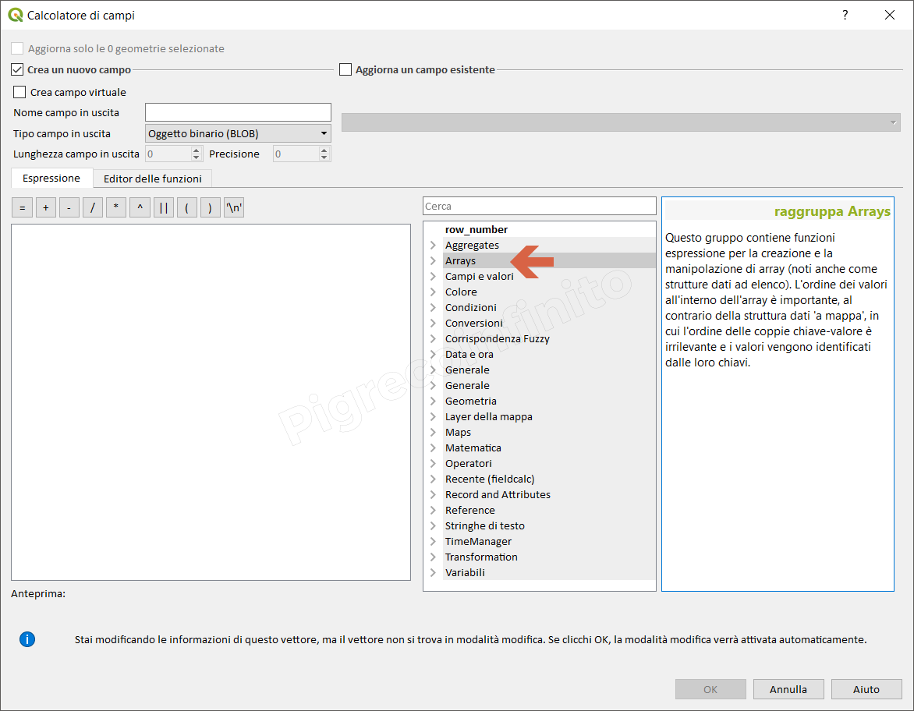

Arrays 
------

Solo DB (es:SpatiaLite, PostGIS)

Questo gruppo contiene funzioni espressione per la creazione e la manipolazione di array (noti anche come strutture dati ad elenco). L'ordine dei valori all'interno dell'array è importante, al contrario della struttura dati 'a mappa' ([gruppo Maps](../maps)), in cui l'ordine delle coppie chiave-valore è irrilevante e i valori vengono identificati dalle loro chiavi.

+--------------------+----------------------------------------------------------------------------------------------------------------------------------------------------------------+-----------+
| Funzione           | Descrizione                                                                                                                                                    | Plugin    |
+====================+================================================================================================================================================================+===========+
| array              | Restituisce un array contenente tutti i valori passati come parametro                                                                                          |           |
+--------------------+----------------------------------------------------------------------------------------------------------------------------------------------------------------+-----------+
| array_append       | Restituisce un array con il valore passato aggiunto alla fine                                                                                                  |           |
+--------------------+----------------------------------------------------------------------------------------------------------------------------------------------------------------+-----------+
| array_avg          | Calcola il valore medio di un array                                                                                                                            | ArrayPlus |
+--------------------+----------------------------------------------------------------------------------------------------------------------------------------------------------------+-----------+
| array_cat          | Restituisce un array contenente tutti gli arrays passati concatenat                                                                                            |           |
+--------------------+----------------------------------------------------------------------------------------------------------------------------------------------------------------+-----------+
| array_contains     | Restituisce true se un array contiene il valore specificato                                                                                                    |           |
+--------------------+----------------------------------------------------------------------------------------------------------------------------------------------------------------+-----------+
| array_count        | Conta un dato valore in un array                                                                                                                               | ArrayPlus |
+--------------------+----------------------------------------------------------------------------------------------------------------------------------------------------------------+-----------+
| array_distinct     | Restituisce un array contenente valori distinti dell'array dato                                                                                                |           |
+--------------------+----------------------------------------------------------------------------------------------------------------------------------------------------------------+-----------+
| array_find         | Restituisce l'indice di un valore all'interno di un array                                                                                                      |           |
+--------------------+----------------------------------------------------------------------------------------------------------------------------------------------------------------+-----------+
| array_first        | Restituisce il primo valore di un array                                                                                                                        |           |
+--------------------+----------------------------------------------------------------------------------------------------------------------------------------------------------------+-----------+
| array_get          | Restituisce il valore ennesimo di un array                                                                                                                     |           |
+--------------------+----------------------------------------------------------------------------------------------------------------------------------------------------------------+-----------+
| array_insert       | Restituisce un array con il valore passato aggiunto nella posizione indicata                                                                                   |           |
+--------------------+----------------------------------------------------------------------------------------------------------------------------------------------------------------+-----------+
| array_lambda       | Applica una funzione personalizzata a ciascun elemento (x)                                                                                                     | ArrayPlus |
+--------------------+----------------------------------------------------------------------------------------------------------------------------------------------------------------+-----------+
| array_intersect    | Restituisce vero se almeno un elemento dell'array1 esiste in array2                                                                                            |           |
+--------------------+----------------------------------------------------------------------------------------------------------------------------------------------------------------+-----------+
| array_last         |  Restituisce l'ultimo valore di un array                                                                                                                       |           |
+--------------------+----------------------------------------------------------------------------------------------------------------------------------------------------------------+-----------+
| array_length       | Restituisce il numero di elementi di un array                                                                                                                  |           |
+--------------------+----------------------------------------------------------------------------------------------------------------------------------------------------------------+-----------+
| array_majority     | Restituisce il valore più comune. Restituisce un valore arbitrario se ex-equo                                                                                  | ArrayPlus |
+--------------------+----------------------------------------------------------------------------------------------------------------------------------------------------------------+-----------+
| array_majority     | Restituisce il valore più comune. Restituisce un valore arbitrario se ex-equo                                                                                  | ArrayPlus |
+--------------------+----------------------------------------------------------------------------------------------------------------------------------------------------------------+-----------+
| array_minority     | Restituisce il valore più comune. Restituisce un valore arbitrario se ex-equo                                                                                  | ArrayPlus |
+--------------------+----------------------------------------------------------------------------------------------------------------------------------------------------------------+-----------+
| array_max          | Restituisce il valore massimo di un array                                                                                                                      | ArrayPlus |
+--------------------+----------------------------------------------------------------------------------------------------------------------------------------------------------------+-----------+
| array_min          | Restituisce il valore minimo di un array                                                                                                                       | ArrayPlus |
+--------------------+----------------------------------------------------------------------------------------------------------------------------------------------------------------+-----------+
| array_prepend      | Restituisce un array con il valore dato aggiunto all'inizio                                                                                                    |           |
+--------------------+----------------------------------------------------------------------------------------------------------------------------------------------------------------+-----------+
| array_prioritize   |  Ordina un array rispetto ad un altro QGIS >= 3.2                                                                                                              | ArrayPlus |
+--------------------+----------------------------------------------------------------------------------------------------------------------------------------------------------------+-----------+
| array_remove_all   | Restituisce un array con tutti gli elementi del valore passato rimossi                                                                                         |           |
+--------------------+----------------------------------------------------------------------------------------------------------------------------------------------------------------+-----------+
| array_remove_at    | Restituisce un array con l'indice passato rimosso                                                                                                              |           |
+--------------------+----------------------------------------------------------------------------------------------------------------------------------------------------------------+-----------+
| array_replace      | Ordina i valori in ordine crescente (usa array_reverse per desc)                                                                                               | ArrayPlus |
+--------------------+----------------------------------------------------------------------------------------------------------------------------------------------------------------+-----------+
| array_reverse      | Restituisce l'array dato con valori dell'array in ordine inverso                                                                                               |           |
+--------------------+----------------------------------------------------------------------------------------------------------------------------------------------------------------+-----------+
| array_slice        | Restituisce una porzione dell'array                                                                                                                            |           |
+--------------------+----------------------------------------------------------------------------------------------------------------------------------------------------------------+-----------+
| array_sort         | Ordina i valori in ordine crescente (usa array_reverse per desc)                                                                                               | ArrayPlus |
+--------------------+----------------------------------------------------------------------------------------------------------------------------------------------------------------+-----------+
| array_sum          | Calcola la somma dei valori                                                                                                                                    | ArrayPlus |
+--------------------+----------------------------------------------------------------------------------------------------------------------------------------------------------------+-----------+
| array_to_string    | Concatena gli elementi di un array in una stringa separata da un delimitatore usando una stringa opzionale per valori mancanti                                 |           |
+--------------------+----------------------------------------------------------------------------------------------------------------------------------------------------------------+-----------+
| regexp_matches     | Restituisce un array di tutte le stringhe catturate dai gruppo,  nell'ordine che i gruppi stessi compaiono con l'espressione regolare  fornita con una stringa |           |
+--------------------+----------------------------------------------------------------------------------------------------------------------------------------------------------------+-----------+
| string_to_array    | Divide la stringa in un array usando il delimitatore fornito e la stringa opzionale per valori mancanti                                                        |           |
+--------------------+----------------------------------------------------------------------------------------------------------------------------------------------------------------+-----------+

.. toctree::
   :maxdepth: 3
   
   array
   array_append
   array_avg
   array_cat
   array_contains
   array_count
   array_distinct
   array_find
   array_get
   array_insert
   array_intersect
   array_lambda
   array_last
   array_length
   array_majority
   array_max
   array_min
   array_minority
   array_prepend
   array_prioritize
   array_remove_all
   array_remove_at
   array_replace
   array_reverse
   array_slice
   array_sort
   array_sum
   array_to_string
   regexp_matches
   string_to_array
   array_first
   
   
   
