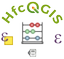

Benvenuti  
---------

HfcQGIS: Help funzioni calcolatore di campi di  Qgis

Questa guida nasce per rispondere alle numerose richieste di aiuto sull'uso del calcolatore di campi e per colmare un vuoto sulla guida online di QGIS con esempi e molti screenshot.

### Contenuti:

* Indice gruppi di funzioni/espressioni (302/397)
* Calcolatore di campi

* Concetti base sul calcolatore di campi
* Che linguaggio usa il calcolatore di campi?
* Introduzione all'interfaccia calcolatore di campi
* Operatori presenti nell'interfaccia del calcolatore

* Novità rilevanti introdotte in QGIS 3.2 Bonn 22/06/2018
* Form drill-down (a cascata) WIDGET
* Cosa puoi fare
* Donazioni

### Ringraziamenti

* Andrea Borruso per il supporto tecnico GitHub, VScode, Markdown, RTD e gitbook;
* Giovan Battista Vitrano per l'idea di realizzare **HfcQGIS** in RTD e la predisposizione del repo GitHub per RTD;
* Ciro Spataro per la guida Read The Docs

### Autore HfcQGIS
* Salvatore FIANDACA 

### Licenze
Se non specificato diversamente, tutti i contenuti sono soggetti alla licenza: Creative Commons Attribution-ShareAlike 4.0 licence (CC BY-SA)

.. toctree::
   :maxdepth: 3

   index 
   
.. toctree::
   :maxdepth: 3

   concetti  

.. toctree::
   :maxdepth: 3

   interfaccia
    
.. toctree::
   :maxdepth: 3

   operatori

.. toctree::
   :maxdepth: 3

   novita_3.2
   
.. toctree::
   :maxdepth: 3

   contributing

.. toctree::
   :maxdepth: 1

   gr_funzioni/index
